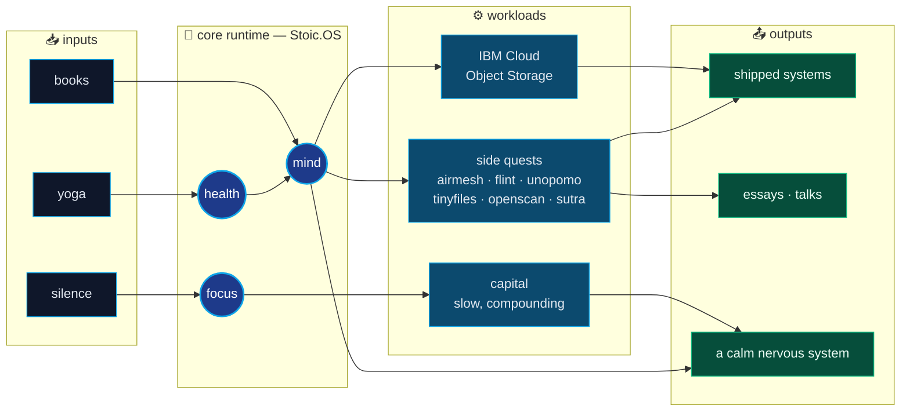

<!--
  ╔══════════════════════════════════════════════════════════════════════╗
  ║                                                                      ║
  ║   "You have power over your mind — not outside events.               ║
  ║    Realize this, and you will find strength."                        ║
  ║                                          — Marcus Aurelius           ║
  ║                                                                      ║
  ║   If you're reading this source, you're already my kind of person.   ║
  ║   Pull requests on my life are welcome. Issues, less so.             ║
  ║                                                                      ║
  ╚══════════════════════════════════════════════════════════════════════╝
-->

<div align="center">

<a href="https://iyashsoni.github.io">
  
</a>

<br/>

<a href="https://x.com/iYash_Soni">
  
</a>

<br/><br/>

<a href="https://iyashsoni.github.io"></a>
<a href="mailto:iyashsoni@outlook.com"></a>
<a href="https://x.com/iYash_Soni"></a>
<a href="https://github.com/iyashsoni?tab=followers"></a>


</div>

---

### `$ whoami`

```bash
$ ssh yash@bangalore.in
Last login: today, 5:30 AM   # the city is asleep, the editor is open

yash@bangalore:~$ cat /etc/identity
ROLE        = "Engineering Lead, IBM Cloud Object Storage"
TENURE      = "10y. Java → distributed systems → leading the people who lead the systems."
LOCATION    = "Bangalore, IN  (IST, but my best ideas keep UTC)"
EDU         = ["BE.IT @ VGEC", "MTech @ IIIT-Bangalore"]
STACK       = ["Java", "Go", "Node", "React", "Kotlin", "Docker", "Distributed Anything"]
OPERATING   = "Stoic.OS  v10.0 — minimal install, no bloatware"
```

---

### `./life --architecture`

> Most people draw system diagrams for their products.
> I draw one for myself, and re-architect it every quarter.



---

### `~/now/building` &nbsp;·&nbsp; small things, shipped on weekends

> The day job is distributed systems at planetary scale.
> The night job is small, sharp tools that respect your attention and your data.

| project | what it does | why it exists |
| :-- | :-- | :-- |
| 🛰️ **AirMesh** | peer-to-peer file transfer over WebRTC, QR-paired, E2E encrypted | because "upload to the cloud to send next door" is absurd |
| 🔥 **Flint** | offline-first habit tracker PWA, streaks that survive flight mode | because discipline shouldn't require Wi‑Fi |
| 🍅 **Unopomo** | pomodoro with ambient soundscapes & themes, multilingual | because focus is a UX problem |
| 📦 **tinyfiles** | in-browser PDF / image compression — nothing leaves your device | because privacy is the new performance |
| 🧵 **Sutra** | living architecture diagrams — plain English in, editable canvas out (AI, bring your own key) | because diagrams shouldn't die the day the system changes |
| 🩻 **OpenScan** | open-source, local-first DICOM workspace — desktop (Tauri) + browser | because viewing your own scans shouldn't require someone else's cloud |

<sub>Theme: <strong>local-first, privacy-first, friction-last.</strong></sub>

---

### `cat ~/.principles`

```python
class Yash:
    """
    Engineer optimized for the long game.
    Not a startup. A compounding portfolio of decisions.
    """

    def __init__(self):
        self.philosophy   = "stoicism"
        self.method       = "minimalism"
        self.medium       = "code, capital, calm"
        self.unfair_edge  = "patience"

    def daily(self):
        yield from (self.read(), self.move(), self.build(), self.reflect())

    def decide(self, problem):
        # premortem > postmortem
        if problem.is_reversible(): return self.ship_fast()
        return self.measure_twice_cut_once()

    def __repr__(self):
        return "build slow systems. trust slow capital. live a quiet life loudly."
```

---

### `git log --author="yash" --since="forever"`

<div align="center">


<br/>


<br/><br/>


</div>

---

### `ls ~/bookshelf | shuf | head -5`

```text
📖 Meditations            — Marcus Aurelius        # the original engineering manual for the self
📖 The Psychology of Money — Morgan Housel          # finance is 1% spreadsheet, 99% behavior
📖 A Philosophy of Software Design — John Ousterhout # the only design book i re-read yearly
📖 Designing Data-Intensive Applications — Kleppmann # required reading for anyone touching prod
📖 The Almanack of Naval Ravikant — Eric Jorgenson  # leverage > effort
```

> currently re-reading the bits of *Meditations* that I underlined in 2019.
> different lines hit now. that's the whole point of re-reading.

---

### `crontab -l` &nbsp;·&nbsp; the rituals

```cron
05 30 * * *   yoga && silence                   # before the world boots up
07 00 * * *   read --pages 20 --no-screens      # analog warmup
09 30 * * 1-5 ibm.review() && ibm.unblock()     # leadership = removing friction
21 00 * * *   journal --stoic --evening         # what did you do well? what can you do better?
00 00 * * 0   review --week --honest            # the weekly post-mortem
```

---

### `man yash` &nbsp;·&nbsp; the things people ask me about

```
NAME
    yash — opinionated software engineer (1.0+)

SYNOPSIS
    yash [--system-design] [--cloud] [--leadership] [--meditation] [--money]

DESCRIPTION
    Reach out if you want to talk about:
      • designing distributed systems that don't page you at 3 AM
      • leading engineers without becoming the bottleneck
      • writing code that your future self will thank you for
      • investing for decades, not quarters
      • starting a meditation practice without becoming insufferable
      • how a CS degree and the Bhagavad Gita are studying the same problem

EXAMPLES
    $ yash --tea --in-person --bangalore
    $ yash --dm --x @iYash_Soni
    $ yash --email iyashsoni@outlook.com
```

---

<div align="center">

<picture>
  <source media="(prefers-color-scheme: dark)" srcset="https://raw.githubusercontent.com/iyashsoni/iyashsoni/output/github-contribution-grid-snake-dark.svg" />
  <source media="(prefers-color-scheme: light)" srcset="https://raw.githubusercontent.com/iyashsoni/iyashsoni/output/github-contribution-grid-snake.svg" />
  
</picture>

<br/>

<sub>
  <strong>memento mori.</strong> ship things that matter.<br/>
  <em>"waste no more time arguing what a good engineer should be. be one."</em> — paraphrased, marcus aurelius<br/><br/>
  ⌁ if you copy this README, leave the stoic quotes in. that's the deal. ⌁
</sub>


</div>
